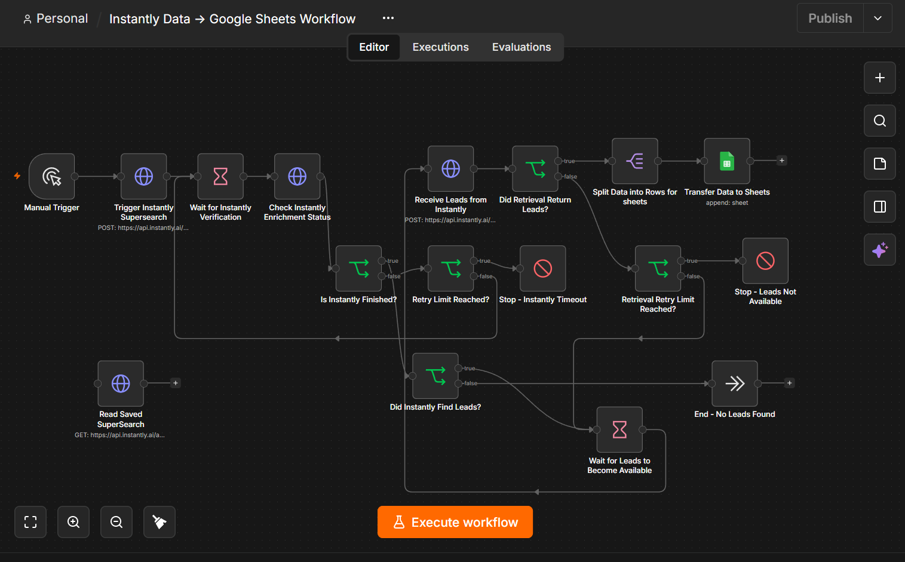

# Automated Instantly Data Pipeline

A GTM workflow I built in n8n to automate account sourcing through the Instantly SuperSearch API and transfer the resulting data into Google Sheets for downstream qualification and scoring with GPT for Sheets.

## Workflow overview

## What it does

The workflow:

- Triggers an Instantly SuperSearch
- Monitors the enrichment process until completion
- Handles retries and timeout scenarios
- Detects searches that return no accounts
- Retrieves the completed dataset
- Splits the results into individual records
- Transfers structured data into Google Sheets

## Workflow logic

Instantly SuperSearch runs asynchronously, so results aren't immediately available after the initial request.

The workflow handles this by polling the enrichment status, retrying when necessary, and separately checking that the completed records are available before transferring them downstream.

Failure and empty-result paths are handled separately so the workflow doesn't assume every search will complete successfully.

## Why I built it

The goal was to remove the manual process of triggering searches, waiting for enrichment, exporting results and transferring data into Sheets.

This creates a reusable sourcing layer that can later feed enrichment, ICP qualification, verification and campaign activation workflows.

## Built with

n8n · Instantly API · Google Sheets API

## Next iteration

**Data sourcing → enrichment → ICP qualification → email verification → campaign activation**
